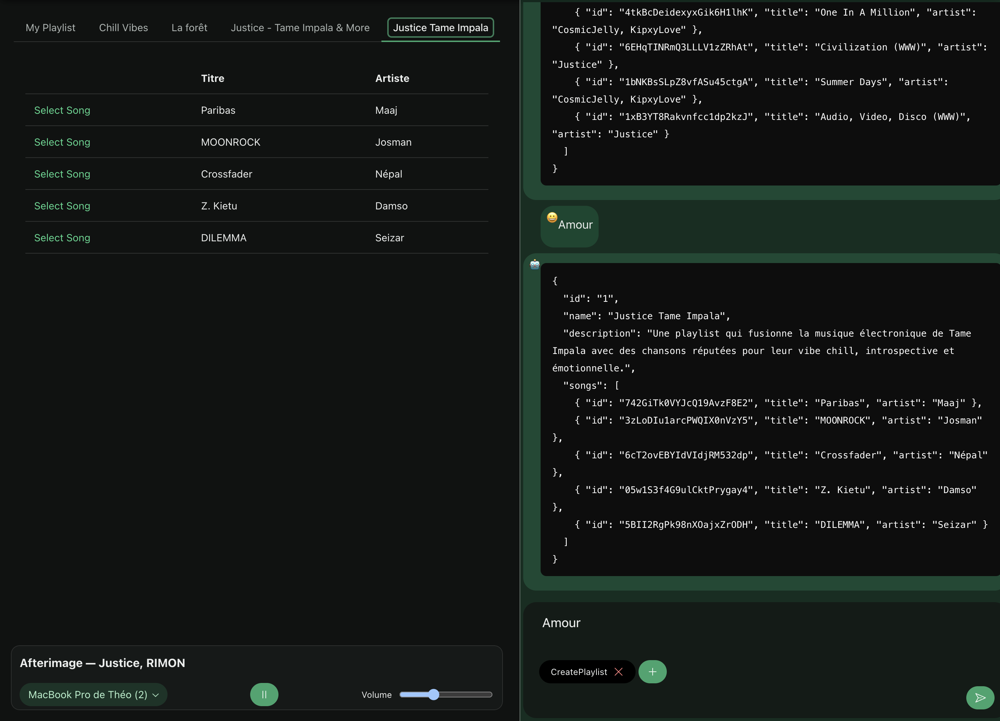
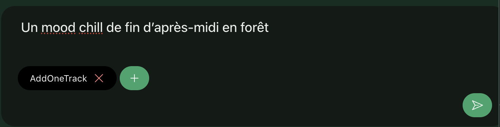
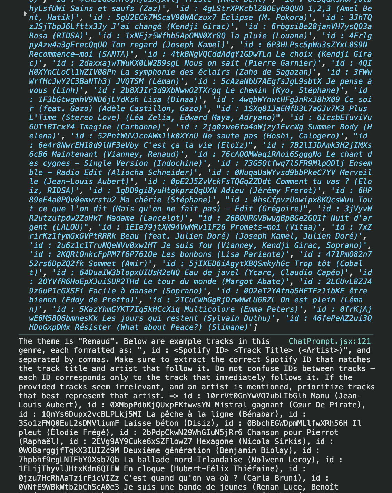
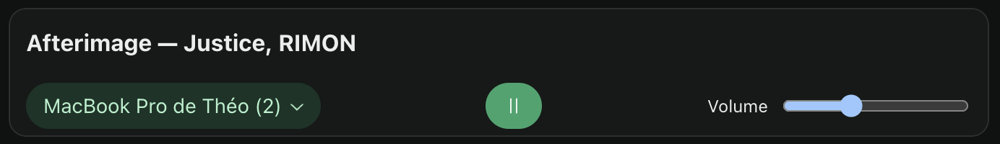

# Rapport - Générateur de Playlists IA avec Spotify API

## Motivation

Le projet est né de l’envie de combiner l’intelligence artificielle et les API modernes pour créer une expérience musicale interactive, personnalisée et fluide.  
L’idée principale était de permettre à un utilisateur de générer automatiquement une playlist ou un morceau correspondant à un thème, une émotion ou un mood, simplement en le décrivant en langage naturel.

Cette démarche vise à rendre la musique plus accessible, plus intuitive, et à explorer le lien entre langage et ambiance sonore.

## Problème

Générer manuellement des playlists cohérentes à partir d’un thème est un processus au final subjectif.  
Les plateformes comme Spotify offrent d'immenses catalogues de data, mais ne permettent pas facilement de générer automatiquement des playlists contextuelles à partir d'une simple phrase comme :

> "Ambiance forêt relaxante, sons naturels."

Les recherches classiques basées sur des mots-clés ne suffisent pas, car elles ne comprennent pas l’intention ou le contexte émotionnel de la demande.

## Solution

J’ai développé une application React qui utilise :

- **Deux agents IA** :
  - `CreatePlaylist` : génère une playlist à partir d’un thème.
  - `AddOneTrack` : propose un morceau unique basé sur le thème.
  
- **L’API Spotify** :
  - Pour rechercher les playlists existantes liées au thème (Comme ça on peux facilement trouver le thème grâce aux playlist de la communauté Spotify).
  - Pour ensuite enrichir les prompts IA avec des exemples réels de tracks (via Spotify Web API).
  - Pour la lecture directe des morceaux (via Spotify Web Playback SDK), si l’utilisateur a Spotify Premium.

- **Un système de prompts dynamiques** :
  - Analyse le message utilisateur.
  - Construit un prompt IA enrichi avec des exemples de pistes récupérées par l’API Spotify grâce aux playlists.
  - Reçoit une réponse IA contenant une playlist ou un track, extraite grâce à Regex et formaté pour être exploitable dans le store React.

- **Une interface utilisateur en trois colonnes** :
  - À gauche : les playlists.
  - À droite : le chatbot (prompt + retour IA), structure JSON générée par les agents.

## Réflexion

Ce projet a été l’occasion d’explorer la **complémentarité entre intelligence artificielle, interface utilisateur et APIs musicales**.

Plusieurs points importants sont ressortis :

### 1. **Langage Naturel ≠ Requête Structurée**

Les utilisateurs expriment souvent leurs envies musicales en langage flou ou émotionnel. Exemples :

- “Un mood chill de fin d’après-midi en forêt”
- “Quelque chose de mystique et calme”

Pour que l’IA ou l’API Spotify comprennent, il faut **traduire ces intentions en mots-clés efficaces**, enrichis par des exemples tangibles (titres, artistes).  
Cela m’a poussé à créer un mini moteur de transformation du langage utilisateur en *prompt IA* structuré et ciblé.

### 2. **Prompt Engineering Central**

Tout le système repose sur la qualité du prompt envoyé à l’agent IA.  
Il ne s’agissait pas juste de transmettre le thème, mais de contextualiser : fournir des exemples de morceaux, structurer les instructions, préciser le format de retour attendu.  
Le prompt final après mofication ressemblait à :

Ce prompt structuré, enrichi dynamiquement, a drastiquement amélioré la qualité + cohérence des réponses IA.

### 3. **Spotify API et Contexte Utilisateur**

Le SDK Spotify m’a permis d’ajouter une couche d’interactivité très forte :

- Lecture en temps réel.
- Sélection du device (app, téléphone, desktop).
- Visualisation et contrôle du son généré par l’IA.

Cela donne une **expérience musicale intelligente et fluide**, sans sortir de l’application.

### 4. **Stockage et réutilisation via le Store**

Toutes les réponses IA (playlists, morceaux) sont injectées dynamiquement dans le store global React (via NanoStores).  
Cela permet de :

- Ajouter de nouveaux morceaux dans une playlist existante.

## Limitations

- Le lecteur Spotify nécessite un compte Spotify authentifié pour se connecter.
- Spotify restreint progressivement l’accès à son API, ce qui limite les informations disponibles.

## Axes d'amélioration

Dans l’optique de permettre une édition complète d’une playlist Spotify, plusieurs fonctionnalités auraient pu être ajoutées avec un peu plus de temps :

- Ajout et modification de playlists directement sur Spotify.
  - Possibilité de récupérer les playlists via l’application mobile, uniquement pour les modifications.

- Ajout d’une fonction de modification plus "classique" afin de proposer des actions standards : recherche de morceaux, réorganisation par **drag and drop**, etc.

- Création de plusieurs autres agents pour affiner davantage les résultats.

## Conclusion

Ce projet démontre qu’en combinant **IA, React et Spotify API**, on peut créer une application musicale intelligente, contextualisée et fluide.

La **réflexion technique** a principalement tourné autour de l’**interprétation du langage humain**, la **structuration des prompts IA** et l’**intégration avec les APIs musicales**.

Le résultat est un outil capable de générer de la musique selon une émotion ou un mood exprimé librement par l’utilisateur, et de la lire en un clic dans l’écosystème Spotify.